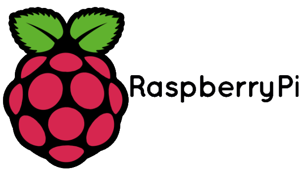
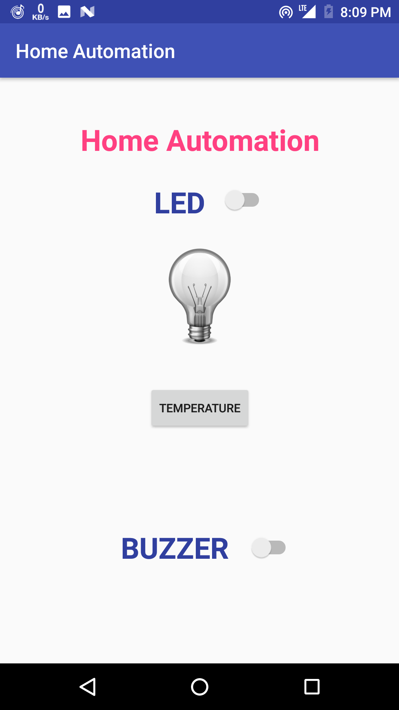
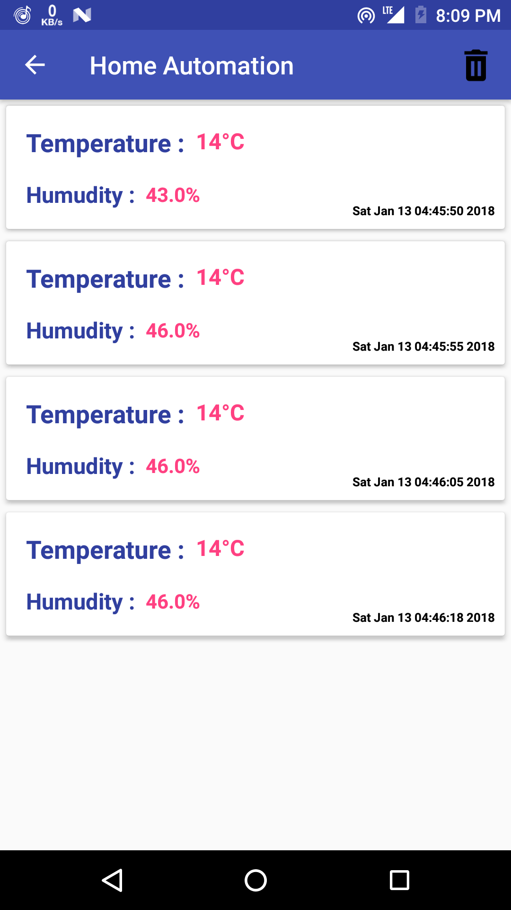
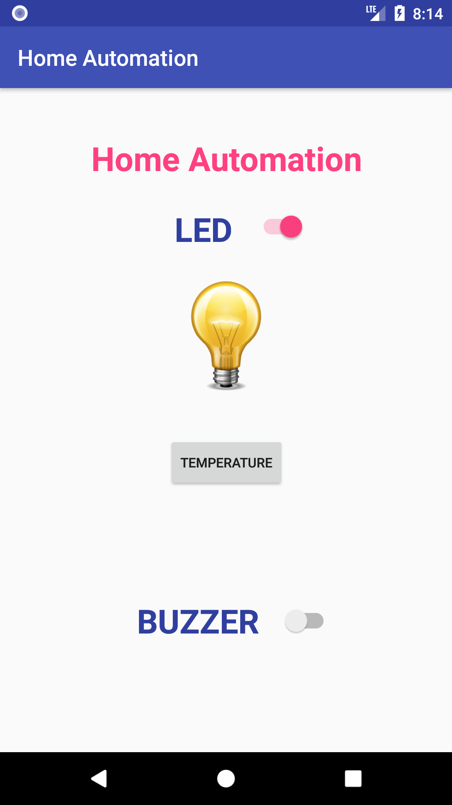

# Home Automation
<table>
  <tr>
    <th>  </th>
    <th>  </th>
  </tr>
</table>

<h1>About the Project</h1>
<ol>
<li>In this Project we have tried to build complete home automation solution.</li>
<li>We have tried to use minimum resources possible.</li>
<li><b>The Complete Project is based  over the Network i.e. It can be accessed around the world when it's made live on Internet.</b></li>
</ol>

<h1>Current Modules of the Project : </h1>
<ol>
<li>Electronics Components Control(ON/OFF).</li>
<li>Fire Control System with Notifications.</li>
<li>Automatic Human Detection Outside the Door.</li>
<li>Pin Door Lock</li>
</ol>

<h1>Upcoming Modules of the Project : </h1>
<ol>
<li>Security Camera live Footage.</li>
<li>Image Recognition Door Lock.</li>
<li>Notifications for all the Persons(Images) Visiting the House.</li>
</ol>

<h1>Technologies Used</h1>
<ul>
<li>ANDROID Libraries</li>
<li>JAVA</li>
<li>Raspberry Pi 3(Model B)</li>
<li>Python</li>
<li>PHP</li>
</ul>

<h1>Glimpses of the App</h1>
<table> 
  <tr>
    <th>  </th>
    <th>  </th>
    <th>  </th>
  </tr>
</table>

<h1>Apk of the App</h1>
<b>Note : </b> This App is still under development and it has certain Hardware requirements. So, you might face some issues.
 
<a href = "https://raw.githubusercontent.com/ashishlkhmn48/HomeAutomation/master/images/ha.apk">Click to Download</a>

<h1>Backend Files of HomeAutomation for Reference</h1>
https://github.com/ashishlkhmn48/HomeAutomation_Files

<h1>References</h1>
  <ul>
  <li>https://www.raspberrypi.org/forums</li>
  <li>https://developer.android.com/reference/org/w3c/dom/Document.html</li>
  <li>https://www.w3schools.com</li>
  <li>https://stackoverflow.com</li>
</ul>
